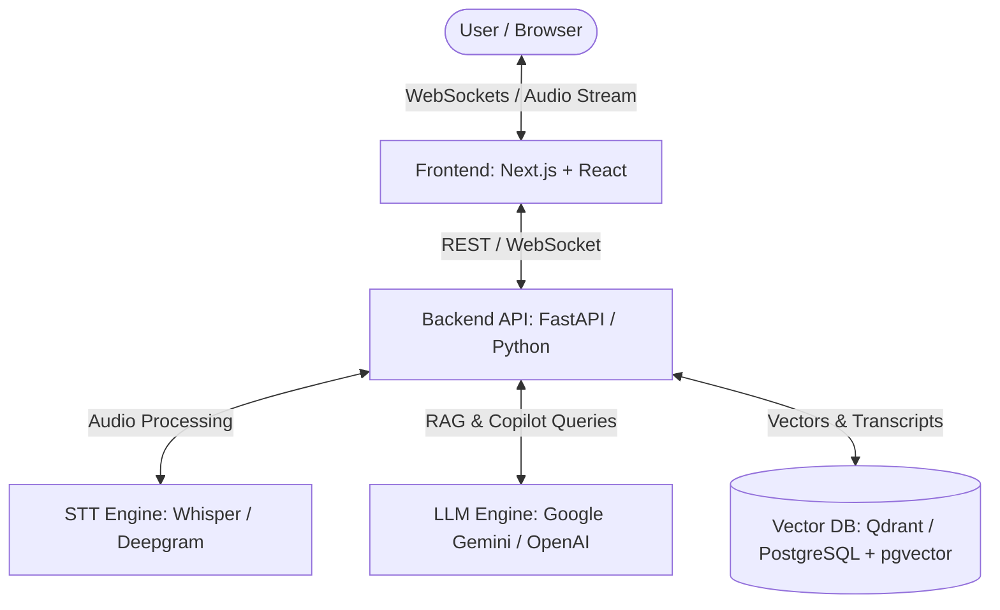

# 🎙️ Meeting Copilot

An intelligent, AI-powered meeting assistant designed to capture, transcribe, summarize, and extract actionable insights from your live meetings in real time.

---

## 📌 Overview

**Meeting Copilot** acts as your personal AI note-taker and context assistant during virtual or in-person meetings. By integrating real-time speech recognition, LLM-powered conversation intelligence, and vector-based semantic search, Meeting Copilot ensures you never miss a decision, action item, or critical detail again.

---

## ✨ Key Features

### 1. 🎧 Live Transcription & Audio Stream Processing
- **Real-Time Speech-to-Text (STT):** High-accuracy live transcription using OpenAI Whisper / Deepgram.
- **Speaker Diarization:** Multi-speaker identification to track who said what.
- **Noise Suppression & Audio Processing:** Web Audio API filtering for crisp capture.

### 2. 🤖 In-Meeting AI Copilot
- **Live Q&A Assistant:** Ask the AI questions about topics discussed earlier in the current meeting.
- **Context-Aware Suggestions:** Live prompt nudges for missed topics, follow-up questions, or technical terminology checks.
- **Instant Search:** Quick semantic lookup across current and past meeting archives.

### 3. 📝 Automated Summaries & Action Items
- **Executive Summaries:** Bulleted meeting summaries categorized by key discussion points.
- **Action Item Extraction:** Auto-detected action items complete with assigned owners, context, and deadline tags.
- **Sentiment & Engagement Analysis:** Overview of team alignment, key decisions, and consensus.

### 4. 📁 Meeting Archive & Knowledge Base
- **Vector Search (RAG):** Retrieve past meeting context using natural language search across all transcripts.
- **Multi-Format Export:** Export notes directly to Markdown, PDF, Notion, Slack, or Google Docs.

---

## 🛠️ Architecture & Tech Stack



### 🎨 Frontend
- **Framework:** Next.js (React 19, TypeScript)
- **Styling:** Modern UI with CSS Modules / Tailwind CSS, dark mode design system
- **Audio & Realtime:** Web Audio API, WebSockets / Socket.io client

### ⚡ Backend
- **Framework:** FastAPI / Python (or Node.js TypeScript API gateway)
- **Realtime Server:** WebSockets / SSE (Server-Sent Events) for live transcript streaming
- **AI Orchestration:** LangChain / LlamaIndex, Google Gemini API / OpenAI API

### 💾 Data & Storage
- **Database:** PostgreSQL (with `pgvector`) or SQLite for local metadata
- **Vector Database:** Qdrant / Chroma / Pinecone for meeting transcript embeddings
- **Audio Storage:** Local file storage / AWS S3 for audio snippet recordings

---

## 📁 Project Structure

```
Meeting-Copilot/
├── api/                  # OpenAPI / Swagger specifications & contracts
├── architecture/         # System design diagrams, specs, & architectural docs
├── backend/              # FastAPI backend (STT pipeline, LLM orchestration, RAG)
│   ├── app/
│   │   ├── api/          # REST & WebSocket routes
│   │   ├── core/         # Config, security, database setups
│   │   ├── services/     # STT, LLM summarizer, action item parser
│   │   └── models/       # Pydantic schemas & DB models
│   └── tests/
├── frontend/             # Next.js web application
│   ├── src/
│   │   ├── components/   # Live recorder, transcript feed, copilot panel
│   │   ├── hooks/        # Web Audio API & WebSocket hooks
│   │   └── pages/app/    # Dashboard, active meeting view, analytics
├── docker/               # Dockerfile and docker-compose configurations
├── docs/                 # User guides and developer setup guides
└── tests/                # Integration and end-to-end test suites
```

---

## 🚀 Getting Started

### Prerequisites
- **Node.js** >= 18.x
- **Python** >= 3.10
- **Docker** (Optional, for running database & vector services)
- API Keys for **Gemini / OpenAI** and **Deepgram / Whisper**

### Quick Setup

1. **Clone the repository:**
   ```bash
   git clone https://github.com/mohit-0105/Meeting-Copilot.git
   cd Meeting-Copilot
   ```

2. **Backend Setup:**
   ```bash
   cd backend
   python -m venv venv
   source venv/bin/activate  # On Windows: venv\Scripts\activate
   pip install -r requirements.txt
   uvicorn app.main:app --reload
   ```

3. **Frontend Setup:**
   ```bash
   cd ../frontend
   npm install
   npm run dev
   ```

---

## 📄 License

Distributed under the MIT License. See `LICENSE` for more information.