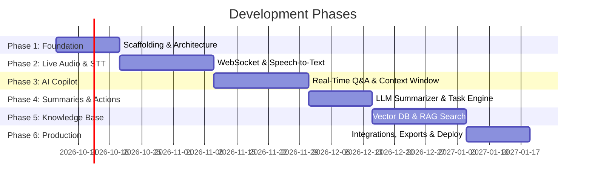

# 🗺️ Meeting Copilot - Project Roadmap

This document outlines the development phases, milestones, and release strategy for **Meeting Copilot**.

---

## 📅 Roadmap Overview

---

## 🎯 Detailed Milestone Plan

### 🚀 Phase 1: Core Foundation & Architecture (Current Phase)
- [ ] **Frontend Initialization**
  - Set up Next.js (App Router, TypeScript) with dark mode glassmorphism UI.
  - Build UI layout shell: Sidebar, Header, Active Meeting view, Dashboard.
- [ ] **Backend Scaffolding**
  - Initialize FastAPI project with async standard structure.
  - Configure CORS, environment settings, and logging handlers.
- [ ] **Data Models & Schemas**
  - Define Pydantic models for `Meeting`, `TranscriptSegment`, `ActionItem`, `Summary`.

---

### 🎙️ Phase 2: Live Audio Pipeline & Streaming STT
- [ ] **Browser Audio Capture**
  - Build `useAudioRecorder` hook using Web Audio API & MediaRecorder.
  - Implement real-time audio chunking (PCM / WebM format).
- [ ] **WebSocket Streaming Core**
  - Establish persistent WebSocket connection between Client and FastAPI.
  - Add connection management, heartbeat, and reconnection logic.
- [ ] **Speech-to-Text (STT) Integration**
  - Connect STT engine (Deepgram / OpenAI Whisper) for live transcription.
  - Stream transcript chunks with timestamps back to the frontend feed.
- [ ] **Speaker Diarization**
  - Identify and separate different speakers in real-time or post-chunk processing.

---

### 🤖 Phase 3: In-Meeting AI Copilot & Real-Time Assistance
- [ ] **Context Manager Service**
  - Implement rolling transcript buffer to feed LLM context window.
- [ ] **In-Meeting Copilot Chat**
  - Build interactive side panel for asking questions during live meetings.
  - Enable instant answers based on meeting context so far.
- [ ] **Smart Proactive Nudges**
  - Auto-suggest follow-up questions or flag unaddressed agenda topics.

---

### 📝 Phase 4: Automated Summarization & Action Item Engine
- [ ] **Meeting Summarizer Service**
  - Generate structured executive summaries with key topics and decisions.
- [ ] **Action Item Extractor**
  - Detect action items, assignees, priorities, and deadlines automatically.
  - Provide inline editing and manual override for action items.
- [ ] **Post-Meeting Insights**
  - Add topic breakdown, speaker participation metrics, and sentiment analysis.

---

### 🔍 Phase 5: Knowledge Base & RAG Vector Search
- [ ] **Vector Database Setup**
  - Deploy PostgreSQL (`pgvector`) or Qdrant for semantic search.
  - Build background indexing pipeline for completed meeting transcripts.
- [ ] **Cross-Meeting Search Engine**
  - Implement semantic search across all historical meetings.
  - Allow users to ask queries across multiple past meetings (e.g., "What did we decide about Q3 budget?").

---

### 📦 Phase 6: Integrations, Export & Production Hardening
- [ ] **Export & Third-Party Sync**
  - Export summaries to Markdown, PDF, Notion, Slack, and Google Docs.
- [ ] **Calendar Sync**
  - Google Calendar / Outlook integration for auto-joining scheduled meetings.
- [ ] **Security & Authentication**
  - Implement JWT authentication & user roles.
  - Secure API keys & audio buffer encryption.
- [ ] **Containerization & Deployment**
  - Dockerize backend, frontend, and vector database services.
  - CI/CD pipeline setup for continuous deployment.

---

## 🚦 Status Tracking

| Phase | Description | Status | Target Completion |
|---|---|---|---|
| **Phase 1** | Foundation & Architecture | 🟡 In Progress | Oct 20, 2026 |
| **Phase 2** | Live Audio & Streaming STT | ⚪ Planned | Nov 10, 2026 |
| **Phase 3** | AI Copilot & Live Assistance | ⚪ Planned | Dec 01, 2026 |
| **Phase 4** | Summaries & Action Items | ⚪ Planned | Dec 15, 2026 |
| **Phase 5** | RAG & Meeting Knowledge Base | ⚪ Planned | Jan 05, 2027 |
| **Phase 6** | Integrations & Production Release | ⚪ Planned | Jan 20, 2027 |
